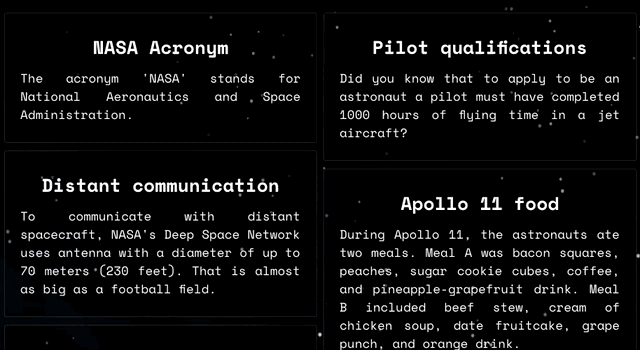

# React CSS modules
### What are CSS Modules?
CSS files in which all class names and animation names are scoped locally by default.
This project is an implementation of tutorial from: https://www.linkedin.com/learning/react-building-styles-with-css-modules-9222678/next-steps?autoAdvance=true&autoSkip=false&autoplay=true&resume=false&u=36447396;

### Additional Readings:
* https://github.com/css-modules/css-modules
* https://create-react-app.dev/docs/adding-a-css-modules-stylesheet
* https://css-tricks.com/css-modules-part-1-need/